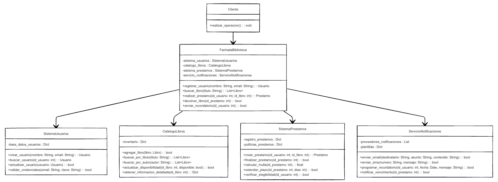

# Facade Pattern
## Problema
Una biblioteca digital necesita integrar múltiples subsistemas complejos: gestión de usuarios, búsqueda de libros, sistema de préstamos, y notificaciones. Los desarrolladores deben interactuar con todos estos subsistemas, lo que genera código acoplado y difícil de mantener.

## Justificación del Patrón Facade
El patrón Facade proporciona una interfaz unificada y simplificada a un conjunto de interfaces en un subsistema. Esto reduce la complejidad y el acoplamiento, permitiendo que los clientes utilicen una única interfaz para acceder a todas las funcionalidades del sistema.

## Diagrama UML

## Explicación del Diagrama

- FachadaBiblioteca: Interfaz simplificada que coordina todos los subsistemas
- SistemaUsuarios: Subsistema para gestionar usuarios
- CatalogoLibros: Subsistema para buscar y gestionar libros
- SistemaPrestamos: Subsistema para manejar préstamos
- ServicioNotificaciones: Subsistema para enviar notificaciones
- Cliente: Código que utiliza la fachada

## Principios SOLID aplicados:

- S (Responsabilidad Única): Cada subsistema tiene una responsabilidad bien definida.
- O (Abierto/Cerrado): Podemos extender la funcionalidad sin modificar la fachada.
- L (Sustitución de Liskov): Los subsistemas pueden ser sustituidos por implementaciones alternativas.
- I (Segregación de Interfaces): Las interfaces de cada subsistema son cohesivas y específicas.
- D (Inversión de Dependencias): La fachada depende de abstracciones, no de implementaciones específicas.